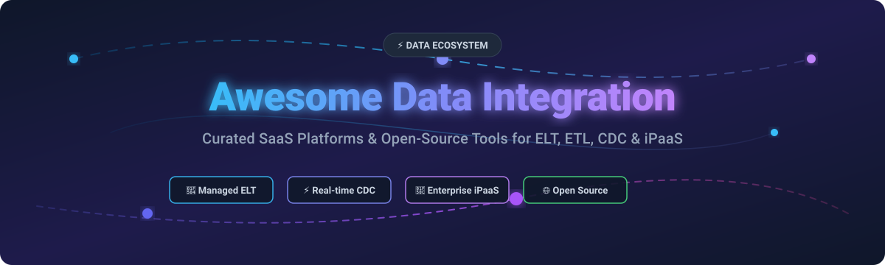

# ⚡ Awesome Data Integration

  

  
  
  
  
  
  
  

---

## 📌 Top Data Integration Platforms & Open-Source Ecosystem

> **Curated List of Commercial SaaS Products, Cloud iPaaS & Open-Source Data Pipelines**  
> *Focused on ELT/ETL, CDC (Change Data Capture), Connectors, Pipeline Orchestration, SaaS-to-Warehouse Sync, & Enterprise Integration.*

**Last updated: October 2026**

This repository tracks notable **SaaS platforms** and **open-source GitHub projects** for **Data Integration**. These systems seamlessly replicate and ingest data between sources and destinations—SaaS applications, operational databases, warehouses (Snowflake, BigQuery, Redshift), and data lakes—via pre-built connectors, Change Data Capture (CDC), and transformation pipelines.

---

## 📋 Table of Contents
- [🏢 SaaS & Cloud Platforms](#-saas--cloud-platforms)
- [🌐 Open-Source GitHub Projects](#-open-source-github-projects)
- [🤝 Support & Sponsorship](#-support--sponsorship)
- [📈 Star History](#-star-history)
- [🛠️ How to Contribute](#%EF%B8%8F-how-to-contribute)
- [⚠️ Disclaimer](#%EF%B8%8F-disclaimer)

---

## 🏢 SaaS & Cloud Platforms

> **Sector Market Overview:** The global Data Integration & iPaaS market is estimated at **$13.5 Billion (2024–2026)** and is projected to surpass **$30+ Billion by 2030** at a CAGR of ~15%. The market is **moderately fragmented**, divided across enterprise iPaaS automation suites (Informatica, Boomi, Workato), modern cloud-native ELT solutions (Fivetran, Matillion, Airbyte), and real-time streaming tools.

Below is a curated list of top SaaS products sorted by estimated company valuation / scale (descending).

| Product | Description | Company Size / Valuation | Starting Pricing | Free Tier / Trial Limit |
| :--- | :--- | :--- | :--- | :--- |
| 🌐 **[Informatica](https://www.informatica.com/)** | Enterprise-grade Intelligent Data Management Cloud (IDMC) for complex multi-cloud data integration, ETL, and governance. | **~$10.0 Billion** Valuation ($1.6B+ ARR) | Starts at **$1,000/month** (Informatica Processing Unit base consumption) | **30-Day Free Trial** (up to 1,000 IPUs / 500 compute hours) |
| ⚡ **[Workato](https://www.workato.com/)** | Enterprise enterprise-wide automation & iPaaS platform for app-to-app workflows and API data integration. | **$5.7 Billion** Valuation (Series E) | Starts at **$10,000/year** (Base platform fee + usage recipes) | **14-Day Free Trial** with pre-built enterprise recipes |
| 🔄 **[Fivetran](https://www.fivetran.com/)** | Managed ELT platform providing automated schema drift handling and 500+ pre-built warehouse connectors. | **$5.6 Billion** Valuation (Series D) | Starts at **$1.00 / MAR** (Monthly Active Rows, ~$60/mo min) | **Free Forever Plan** (up to 500,000 MARs/month) & **14-Day Unlimited Free Trial** |
| 🔌 **[Boomi](https://boomi.com/)** | Cloud-native enterprise iPaaS for application integration, B2B data exchange, and API management. | **~$4.0 Billion** Valuation (Acquired by Francisco/TPG) | Starts at **$549/month** (Standard Integration tier) | **30-Day Free Trial** with full integration platform access |
| 🛠️ **[Talend (Qlik)](https://www.talend.com/)** | Comprehensive data integration, data quality, and governance suite (Stitch + Talend Cloud). | **~$2.4 Billion** Valuation (Acquired by Thoma Bravo) | Starts at **$1,170/month** (Talend Data Integration / Stitch Standard) | **14-Day Free Trial** for Stitch Data Loader & Talend Cloud |
| 🚀 **[Airbyte (Cloud)](https://airbyte.com/)** | Fully managed cloud offering built on the open-source Airbyte connector framework. | **$1.5 Billion** Valuation (Series B) | Starts at **$2.50 per credit** (~$10/month min pay-as-you-go) | **$500 Free Credits** upon signup (valid 14 days) + **100% Free Self-Hosted Edition** |
| 🧱 **[Matillion](https://www.matillion.com/)** | Cloud-native ELT platform pushing data transformations directly into Snowflake, Databricks, and BigQuery. | **$1.5 Billion** Valuation (Series E) | Starts at **$2.00 per credit** (~$500/month Standard tier) | **500 Free Credits/month** (~$1,000 value) on Free Plan or **14-Day Free Trial** |
| 🔗 **[Celigo](https://www.celigo.com/)** | Next-generation iPaaS optimized for business process automation, SaaS-to-SaaS syncing, and ERP connectors. | **~$1.0 Billion** Valuation (~$100M ARR) | Starts at **$600/month** (Standard Plan) | **30-Day Free Trial** (includes 1 active integration flow) |
| 📊 **[Hevo Data](https://hevodata.com/)** | No-code data pipeline platform providing near real-time ELT into cloud data warehouses. | **~$500 Million** Valuation (Series B) | Starts at **$239/month** (Starter Plan, 5M events/mo) | **Free Forever Plan** (up to 1 Million events/month) & **14-Day Free Trial** |
| 🌊 **[Rivery](https://rivery.io/)** | SaaS ELT platform featuring python-based transformation logic, reverse ETL, and workflow orchestration. | **~$100 Million** Valuation (Series B) | Starts at **$0.75 per RDU** (~$120/month Starter Plan) | **14-Day Free Trial** (includes 1,000 free pipeline execution RDUs) |

---

## 🌐 Open-Source GitHub Projects

Open-source data integration projects give engineering teams full control over data privacy, self-hosting, and connector customization.

The list below is sorted by **GitHub Stars_Count** (descending).

| Project | Description | GitHub_Stars |
| :--- | :--- | :--- |
| 💨 **[Apache Airflow](https://github.com/apache/airflow)** | Programmatically author, schedule, and monitor complex data engineering pipelines as Python DAGs. |  |
| 🪵 **[Apache Kafka](https://github.com/apache/kafka)** | Distributed event streaming platform featuring **Kafka Connect** for scalable, fault-tolerant connector streaming. |  |
| ⚡ **[Prefect](https://github.com/PrefectHQ/prefect)** | Workflow orchestration engine designed for modern Python data pipelines and real-time execution tracking. |  |
| 🏹 **[Vector](https://github.com/vectordotdev/vector)** | High-performance, lightweight Rust-based data pipeline for collecting, transforming, and routing observability & log data. |  |
| 🚀 **[Airbyte](https://github.com/airbytehq/airbyte)** | Leading open-source data movement engine featuring 600+ connectors for ELT into data warehouses and lakes. |  |
| 🎓 **[Dagster](https://github.com/dagster-io/dagster)** | Data orchestrator built for Machine Learning, Analytics, and ETL with software-defined asset graphs. |  |
| 🔄 **[Debezium](https://github.com/debezium/debezium)** | Distributed Change Data Capture (CDC) platform capturing database commit logs (MySQL, PostgreSQL, MongoDB). |  |
| ☁️ **[CloudQuery](https://github.com/cloudquery/cloudquery)** | High-performance open-source ELT framework extracting cloud asset configurations into databases via SQL. |  |
| 🐫 **[Apache Camel](https://github.com/apache/camel)** | Versatile enterprise integration framework implementing Enterprise Integration Patterns (EIP) for Java & Spring. |  |
| 🌊 **[Apache NiFi](https://github.com/apache/nifi)** | Visual dataflow design engine providing automated routing, transformation, and drag-and-drop system integration. |  |
| 🦊 **[Meltano](https://github.com/meltano/meltano)** | CLI-first open-source ELT platform built on Singer taps & targets with full GitOps and version-control workflows. |  |
| 🦀 **[RudderStack](https://github.com/rudderlabs/rudder-server)** | Customer data platform (CDP) engine for collecting event streams, warehouse syncing, and reverse ETL. |  |
| 🐍 **[dlt (data load tool)](https://github.com/dlt-hub/dlt)** | Python library for data engineers to build self-maintaining ELT pipelines with dynamic schema detection. |  |
| 🎤 **[Singer](https://github.com/singer-io/getting-started)** | Open specification standard defining JSON data extraction taps and target loaders. |  |
| 🌊 **[Estuary Flow](https://github.com/estuary/flow)** | Real-time streaming data integration platform for sub-second database replication and pipeline CDC. |  |

---

## 🤝 Support & Sponsorship

If you find this repository helpful for evaluating data integration tools or architecting data engineering stacks, please consider supporting the project!

- 🌟 **Star this repository** to help others discover it.
- 🔀 **Fork & Share** with your colleagues and data engineering communities.
- 💖 **Sponsor the Maintainer**: Support ongoing updates and curated developer resources via [GitHub Sponsors](https://github.com/sponsors/ishandutta2007).

  

---

## 📈 Star History

---

## 🛠️ How to Contribute

We welcome community contributions to expand and maintain this list!

1. **Fork** this repository.
2. Edit `README.md` following the tabular layout.
3. Ensure entries include exact pricing, free tier details, company valuation, and Stars_Count badges.
4. Submit a **Pull Request** with a clear title and summary of changes.

---

## ⚠️ Disclaimer

- This curated list is maintained for informational and educational purposes.
- Product pricing and limits are subject to change by vendor organizations; check official platform documentation for current rates.
- Data integration pipelines process sensitive enterprise datasets; ensure proper encryption, IAM controls, and network security compliance when deploying pipelines.

---

  Made with ❤️ for data engineers, analytics professionals, and open data platform architects. 
  Part of the <a href="https://github.com/ishandutta2007/Awesome-Awesome-Awesome">Awesome Lists Collection</a>.

